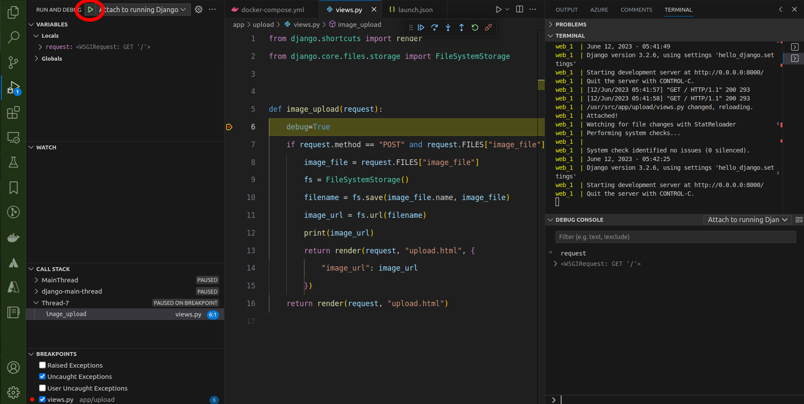

# Debugging a Dockerised Django App in VS Code

### Prerequisites

- docker and docker-compose installed

## Usage:

1. Run it.

   ```bash
    docker-compose up --build
   ```

2. Set a breakpoint and run the launch configuration.
   

## References. A thousand thankyous 🙏

Source article:

- https://testdriven.io/blog/django-debugging-vs-code/

Code:

- https://testdriven.io/blog/dockerizing-django-with-postgres-gunicorn-and-nginx/
